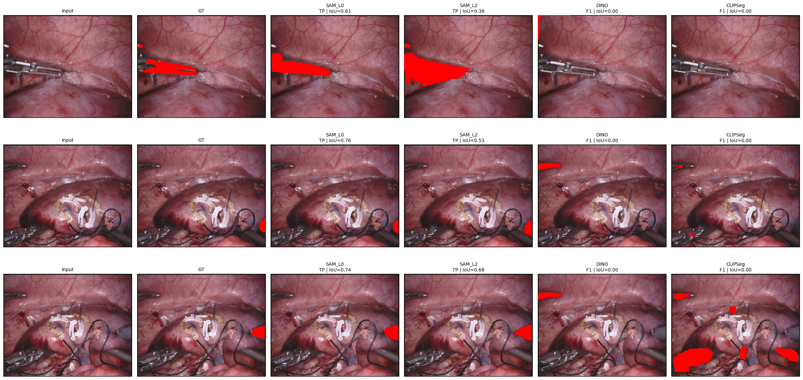
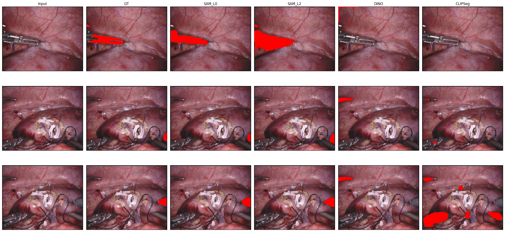
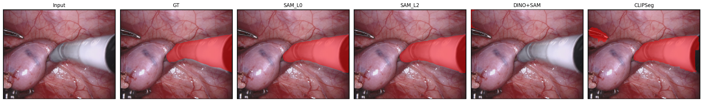
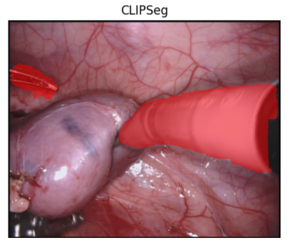

# Zero-Shot Surgical Segmentation Evaluation with Vision-Language Models

> A research framework for evaluating how prompt-based and zero-shot surgical segmentation pipelines fail under realistic localization conditions.

[](https://www.python.org/)
[](https://pytorch.org/)
[](https://colab.research.google.com/)
[]()
[]()
[]()

---

## Overview

This repository investigates **zero-shot and prompt-based surgical scene segmentation** using vision-language and foundation-model pipelines.

The central contribution is not a simple model leaderboard. Instead, this project asks:

> **Where do surgical segmentation pipelines actually fail: detection, localization, mask generation, or semantic alignment?**

To answer this, the project builds an evaluation workflow around:

- prompt-ladder experiments,
- localization degradation analysis,
- segmentation quality metrics,
- method-level failure taxonomy,
- and qualitative failure visualization.

The main finding is that **localization quality is often the dominant bottleneck**. Promptable segmentation models can produce useful masks when prompts are accurate, but performance degrades sharply as prompts become noisy, shifted, or detector-generated.

---

## Research Question

Modern promptable segmentation models can perform well when given strong spatial prompts. But in realistic surgical workflows, those prompts may come from a user, a detector, a grounding model, or a language-conditioned system.

This project studies:

> **How robust are zero-shot surgical segmentation pipelines when prompts move from oracle-quality localization to noisy or detector-generated localization?**

The evaluation separates the pipeline into:

```text
Detection → Localization → Segmentation → Failure Analysis
```

This makes it possible to distinguish:

- whether the target object was detected at all,
- whether the localization prompt was placed correctly,
- whether the segmentation model produced a useful mask,
- and whether two methods with similar Dice/IoU fail in different ways.

---

## Why This Matters

Surgical segmentation is challenging because surgical scenes often contain:

- small and thin instruments,
- occlusions,
- smoke, blur, and blood,
- specular highlights,
- overlapping tools and tissue,
- visually similar structures,
- and rapid frame-to-frame changes.

A single Dice or IoU score can hide very different operational behaviors. For example, two methods may achieve similar aggregate scores, but one may mostly fail by missing the target while another may localize the object but produce incomplete masks.

This repository therefore treats segmentation as a diagnostic pipeline rather than a single black-box output.


---

## Core Contribution

This project contributes a **failure-aware evaluation framework** for surgical segmentation under prompt degradation.

### 1. Prompt Ladder Evaluation

The prompt ladder progressively degrades localization quality to simulate increasingly realistic conditions.

| Level | Description | Purpose |
|---|---|---|
| **SAM_L0** | Oracle bounding box from ground truth | Measures best-case promptable segmentation capability |
| **SAM_L1** | Mildly degraded bounding box | Simulates small localization error |
| **SAM_L2** | Moderately degraded bounding box | Simulates imperfect user or model-generated localization |
| **SAM_L3** | Strongly degraded bounding box | Simulates severe localization drift |
| **DINO+SAM** | Detector/grounding-style box followed by SAM | Tests automatic detection-to-segmentation behavior |
| **CLIPSeg** | Text-conditioned segmentation baseline | Tests direct language-guided segmentation behavior |

The main result is the **degradation curve**, not simply the best score.

---

### 2. Localization-Centric Analysis

Instead of evaluating only final masks, the project frames segmentation as:

```text
Detection → Localization → Mask Generation
```

This allows each method to be analyzed by where it breaks:

- **Detection failure:** the object is not found.
- **Localization failure:** the prompt or predicted region is poorly aligned.
- **Mask-quality failure:** the target is found, but the predicted mask is incomplete or noisy.
- **Semantic mismatch:** the method responds to the wrong structure or class cue.

---

### 3. Failure Taxonomy

The final benchmark tracks both quantitative metrics and failure-mode distributions.

| Label | Meaning |
|---|---|
| **TP** | True positive: target is localized and segmented with usable overlap |
| **F1** | Detection failure: no usable target mask or object effectively missed |
| **F2** | Localization failure: prediction exists but is poorly aligned with the target |
| **F3** | Partial / low-quality segmentation: target is found, but mask quality is incomplete or degraded |

This taxonomy is useful because Dice and IoU alone do not explain *why* a method failed.

---

## Main Result: Prompt Degradation and Method Comparison

The table below summarizes the final method × prompt-level matrix from the evaluation workflow.

| Method | Mean IoU | Mean Dice | Detection Rate | TP Rate | F1 Rate | F2 Rate | F3 Rate |
|---|---:|---:|---:|---:|---:|---:|---:|
| **SAM_L0** | **0.5679** | **0.6456** | **0.7023** | **0.6907** | 0.0000 | 0.2977 | 0.0116 |
| **SAM_L1** | 0.4901 | 0.5675 | 0.6177 | 0.6144 | 0.0000 | 0.3823 | 0.0033 |
| **SAM_L2** | 0.4311 | 0.4965 | 0.5315 | 0.5249 | 0.0000 | 0.4685 | 0.0066 |
| **SAM_L3** | 0.3475 | 0.4062 | 0.4515 | 0.4398 | 0.0000 | 0.5485 | 0.0116 |
| **DINO+SAM** | 0.3060 | 0.3554 | 0.3768 | 0.3668 | 0.0000 | 0.6232 | 0.0100 |
| **CLIPSeg** | 0.0764 | 0.1090 | 0.0880 | 0.0780 | 0.4838 | 0.4282 | 0.0100 |

### Interpretation

The results show a clear degradation pattern:

- **SAM_L0 performs best**, as expected, because it receives oracle-quality localization.
- Performance drops steadily from **SAM_L0 → SAM_L1 → SAM_L2 → SAM_L3**, showing that localization noise directly reduces segmentation quality.
- **DINO+SAM underperforms oracle and degraded SAM prompts**, suggesting that detector/grounding localization is a major bottleneck.
- **CLIPSeg has substantially lower Dice/IoU and high F1/F2 failure rates**, indicating difficulty with direct text-conditioned surgical segmentation in this setup.
- The increasing **F2 localization failure rate** across degraded prompts supports the central claim: segmentation quality is tightly coupled to localization quality.

---

## Qualitative Failure Analysis

The quantitative table is only part of the story. Surgical segmentation errors are easier to understand visually, especially when separating localization failures from mask-quality failures.

### Main Qualitative Figure

```text
assets/qualitative/failure_analysis_exp16.png
```



> **Qualitative failure analysis.** Each row shows one surgical frame and target class. Columns compare oracle-prompt SAM, degraded-prompt SAM, detector-guided SAM, and text-conditioned CLIPSeg predictions. Prediction panels include IoU and failure labels.

---

### 1. Prompt Ladder Degradation Example

```text
assets/qualitative/prompt_ladder_degradation.png
```

a single frame showing:

```text
Input → Ground Truth → SAM_L0 → SAM_L1 → SAM_L2 → SAM_L3
```

 :



---

### 2. DINO+SAM Localization Failure

```text
assets/qualitative/dino_sam_localization_failure.png
```

Case where the detector/grounding box is wrong or shifted, causing SAM to segment the wrong region.

 :



---

### 3. CLIPSeg Semantic / Detection Failure

```text
assets/qualitative/clipseg_failure_case.png
```

CLIPSeg failure showing either no useful detection, wrong structure, or noisy activation.

 :



---

### 4. Failure Taxonomy Grid

```text
assets/qualitative/failure_taxonomy_grid.png
```

figure showing one representative example each for TP, F1, F2, and F3.

 :


---

## Methods Explored

This repository includes experiments and exploratory workflows involving:

| Method / Family | Role in Project |
|---|---|
| **SAM-style promptable segmentation** | Main segmentation engine for prompt ladder experiments |
| **DINO+SAM-style pipelines** | Detector/grounding localization followed by segmentation |
| **CLIPSeg** | Direct text-conditioned segmentation baseline |
| **CLIP-style scoring** | Semantic scoring and image-text alignment exploration |
| **BLIP / BLIP-2** | Captioning and VQA-style surgical scene understanding |
| **SEEM-style segmentation** | Open-vocabulary / promptable segmentation exploration |
| **U-Net baselines** | Supervised reference point for segmentation |
| **Custom VLM implementation** | Architectural understanding of vision-language fusion |

The broader repository began as a medical VLM exploration, including TP-SIS reproduction, EndoVis preprocessing, and custom VLM development. The current flagship direction is the **evaluation framework for zero-shot surgical segmentation under localization degradation**.

---

## Datasets

The project uses surgical segmentation datasets across different stages of experimentation.

| Dataset | Use in Project |
|---|---|
| **EndoVis 2017** | Main surgical instrument segmentation and prompt-ladder evaluation |
| **EndoVis 2018** | Dataset audit and extension target for broader surgical segmentation evaluation |
| **CholecSeg8k** | Cross-dataset / cholecystectomy scene segmentation exploration |

### Dataset Notes

- EndoVis-style datasets are used to evaluate surgical instrument segmentation under different prompt conditions.
- CholecSeg8k experiments are treated as cross-dataset exploration because class definitions, masks, and visual structure differ from EndoVis.
- Some experiments are notebook-driven and require local dataset paths or Google Drive mounting.

Example paths used during experimentation:

```text
/content/EndoVis2017_extracted
/content/EndoVis2018
/content/datasets/CholecSeg8k
```

---

## Preliminary Cross-Dataset Experiments

Preliminary CholecSeg8k experiments were also run to test generalization beyond the main EndoVis setup.

| Method | Mean IoU | Mean Dice | Detection Rate | TP Rate | F1 Rate | F2 Rate | F3 Rate | N |
|---|---:|---:|---:|---:|---:|---:|---:|---:|
| **SAM_L1** | 0.4403 | 0.5713 | 0.6559 | 0.6301 | 0.0860 | 0.2581 | 0.0258 | 465 |
| **DINO+SAM** | 0.0000 | 0.0000 | 0.0000 | 0.0000 | 1.0000 | 0.0000 | 0.0000 | 465 |
| **CLIPSeg** | 0.0095 | 0.0172 | 0.0000 | 0.0000 | 0.9699 | 0.0301 | 0.0000 | 465 |

### Note on CholecSeg8k Results

These results are marked as **preliminary** because later debugging suggested that detector/localization behavior may require dataset-specific handling. They are included to show cross-dataset evaluation direction, not as the final CholecSeg8k benchmark.

---

## Evaluation Metrics

| Metric | Purpose |
|---|---|
| **Dice Score** | Measures mask overlap quality |
| **IoU** | Measures intersection-over-union overlap |
| **Detection Rate** | Measures whether the method produced a usable detection |
| **TP Rate** | Measures successful target localization and segmentation |
| **F1/F2/F3 Rates** | Quantifies failure-mode distribution |
| **Qualitative Grids** | Shows visual differences between failure types |

The core evaluation principle is:

> Dice and IoU measure mask overlap, but failure taxonomy explains why the overlap succeeds or fails.

---

## Key Findings

### 1. Prompt quality strongly controls segmentation quality

The degradation from SAM_L0 to SAM_L3 shows that segmentation quality declines as the localization prompt becomes less reliable.

### 2. Localization is a major bottleneck

The rise in F2 failure rate across degraded prompts suggests that many failures are caused by poor localization rather than mask generation alone.

### 3. Oracle-prompt performance overestimates realistic performance

SAM_L0 shows what promptable segmentation can do under ideal localization. But automatic or degraded localization produces substantially lower results.

### 4. Detector-guided segmentation inherits detector errors

DINO+SAM performance is limited by the quality of the generated localization region. When the detector/grounding step fails, SAM often segments the wrong area or an irrelevant region.

### 5. Direct text-conditioned segmentation remains difficult in surgical scenes

CLIPSeg performs poorly in this evaluation, suggesting that direct language-guided segmentation struggles with fine-grained surgical instruments and scene ambiguity.

### 6. Failure taxonomy reveals differences hidden by aggregate metrics

Methods with similar Dice or IoU can fail in different ways. Reporting F1/F2/F3 distributions makes the comparison more interpretable.

---

## Repository Structure

The repository is notebook-driven and research-stage. The intended organization is:

```text
vlm-research/
├── README.md
├── notebooks/
│   ├── surgical-vlms-1/
│   ├── EndoVisio2017/
│   ├── VLM-Implementation/
│   └── experiments/
├── results/
│   ├── exp13_method_prompt_matrix.csv
│   └── cholecseg8k_preliminary_results.csv
├── assets/
│   └── qualitative/
│       ├── failure_analysis_exp16.png
│       ├── prompt_ladder_degradation.png
│       ├── dino_sam_localization_failure.png
│       ├── clipseg_failure_case.png
│       └── failure_taxonomy_grid.png
├── src/
│   ├── data/
│   ├── models/
│   ├── evaluation/
│   ├── inference/
│   └── utils/
└── requirements.txt
```

If some folders are not present yet, they represent the target cleaned structure for consolidating the project.

---

## How to Read This Repository

Recommended reading order:

1. **Dataset exploration / preprocessing notebooks**  
   Understand EndoVis and CholecSeg8k structure, masks, labels, and preprocessing.

2. **Baseline segmentation workflows**  
   Review supervised or promptable segmentation baselines.

3. **Prompt ladder experiments**  
   Study how SAM-style segmentation changes from oracle to degraded prompts.

4. **Detector / grounding + segmentation experiments**  
   Review DINO+SAM-style workflows and localization-driven failure cases.

5. **Text-conditioned segmentation experiments**  
   Review CLIPSeg and language-guided segmentation behavior.

6. **Failure taxonomy and visualization notebooks**  
   Analyze where methods break and how those failures appear visually.

---

## Quick Start

Clone the repository:

```bash
git clone https://github.com/AjaySreekumar47/vlm-research.git
cd vlm-research
```

Install dependencies as needed:

```bash
pip install -r requirements.txt
```

For Google Colab workflows:

```python
from google.colab import drive
drive.mount('/content/drive')
```

Update dataset paths inside notebooks as needed:

```text
/content/EndoVis2017_extracted
/content/EndoVis2018
/content/datasets/CholecSeg8k
```

---

## Reproducibility Notes

This is a research-stage repository. Some workflows may require:

- Google Colab GPU runtime,
- dataset access and manual dataset placement,
- model checkpoints,
- external repositories,
- local path updates,
- or Google Drive mounting.

Future cleanup will consolidate:

- environment setup,
- dataset preprocessing,
- model loading,
- prompt generation,
- metric computation,
- result export,
- and figure generation.

---

## Roadmap

### Completed / In Progress

- [x] EndoVis dataset exploration and preprocessing
- [x] Surgical segmentation baselines
- [x] Prompt-based segmentation experiments
- [x] Prompt ladder design
- [x] Localization degradation experiments
- [x] DINO+SAM-style detector-to-segmentation evaluation
- [x] CLIPSeg text-conditioned segmentation baseline
- [x] Failure taxonomy design
- [x] Qualitative failure visualization
- [x] Final method × prompt-level matrix
- [ ] Clean result CSV export
- [x] Add final qualitative images to `assets/qualitative/`
- [ ] Convert notebook workflow into reusable scripts
- [ ] Extend finalized benchmark to EndoVis2018 and CholecSeg8k

### Future Directions

- Temporal consistency across surgical video frames
- Visual consistency checks across adjacent frames
- Stronger grounding models for instrument localization
- Improved open-vocabulary surgical class handling
- Interactive language-guided segmentation
- Unified benchmark across EndoVis and CholecSeg8k
- Paper-style writeup of prompt degradation and failure taxonomy results

---

## Research Positioning

This project is best understood as an **evaluation and diagnostics framework** for prompt-based surgical segmentation.

The core claim is:

> Promptable surgical segmentation should be evaluated under realistic localization conditions because oracle-prompt performance can hide the true bottleneck.

This framing supports research in:

- surgical AI robustness,
- vision-language model evaluation,
- promptable segmentation,
- grounding-based segmentation,
- medical image understanding,
- and failure-aware model analysis.

---

## Acknowledgments

This work builds on open-source research and tools from the broader computer vision, medical AI, and vision-language modeling communities, including segmentation foundation models, EndoVis challenge datasets, and open VLM research.

## License

This repository is released under the MIT License. See `LICENSE` for details.
