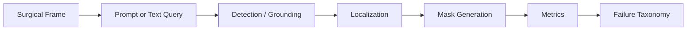

# Zero-Shot Surgical Segmentation Evaluation with Vision-Language Models

> Evaluation framework for studying how prompt-based and zero-shot surgical segmentation pipelines behave under realistic localization conditions.

[](https://www.python.org/)
[](https://pytorch.org/)
[](https://colab.research.google.com/)
[]()
[]()

---

## Overview

This repository investigates **zero-shot and prompt-based surgical scene segmentation** using vision-language and foundation-model pipelines.

The central goal is not just to compare models by Dice or IoU. Instead, this project asks a more diagnostic question:

> **Where do prompt-based surgical segmentation pipelines actually fail: detection, localization, mask generation, or class-level reasoning?**

To answer this, the project develops an evaluation framework around:

- prompt-ladder experiments,
- localization degradation analysis,
- segmentation quality metrics,
- qualitative failure cases,
- and structured failure taxonomy.

The current README replaces an earlier broad “medical VLM exploration” framing. The earlier version described the project as a journey through TP-SIS reproduction, EndoVis processing, and custom VLM development. The flagship framing here focuses on the strongest current research contribution: **evaluation of prompt-driven surgical segmentation under realistic failure conditions**.

---

## Research Question

Modern segmentation foundation models can produce strong masks when given accurate prompts. But in real surgical scenes, the hard part is often not mask generation alone.

This project studies:

> **How robust are zero-shot surgical segmentation pipelines when prompts move from oracle-quality localization to noisy, degraded, or detector-generated localization?**

In practical terms, the work separates the pipeline into:

1. **Detection** — was the object/instrument identified at all?
2. **Localization** — was the prompt, point, or bounding box placed near the correct structure?
3. **Segmentation** — given the prompt, did the model produce a useful mask?
4. **Failure interpretation** — what kind of failure occurred, and is it consistent across methods?

---

## Why This Matters

Surgical segmentation is difficult because surgical scenes contain:

- small and thin instruments,
- specular highlights,
- occlusions,
- smoke, blur, and blood,
- overlapping tools and tissues,
- visually similar structures,
- strong frame-to-frame variation.

A single Dice or IoU score can hide very different behaviors. Two methods may achieve similar aggregate scores while failing for completely different reasons.

This project therefore treats segmentation as a pipeline:



The main idea is:

> **Prompt quality and localization quality often explain segmentation degradation more clearly than mask quality alone.**

---

## Core Contribution

This repository contributes an evaluation framework for prompt-based surgical segmentation with four main components:

### 1. Prompt Ladder Evaluation

The prompt ladder progressively degrades the quality of localization prompts to simulate increasingly realistic conditions.

Example framing:

| Level | Prompt Condition | What It Simulates |
|---|---|---|
| L0 | Oracle / near-perfect prompt | Best-case segmentation capability |
| L1 | Mildly degraded prompt | Small localization error |
| L2 | Moderately degraded prompt | Imperfect detector or user prompt |
| L3 | Strongly degraded prompt | Realistic localization failure |
| Detector-based | Model-generated box/query | Fully automatic zero-shot pipeline |

The purpose is to measure the **degradation curve**, not just the best-case score.

---

### 2. Localization-Centric Analysis

Instead of treating segmentation as a single black box, experiments are framed as:

```text
Detection → Localization → Segmentation
```

This makes it possible to ask:

- Did the model fail because the object was not found?
- Did it find the object but place the prompt badly?
- Did the segmentation model fail despite a good prompt?
- Did the predicted mask capture only partial pixels?
- Did the method hallucinate a nearby structure?

---

### 3. Failure Taxonomy

The project tracks qualitative and quantitative failure modes to distinguish between visually different errors.

Example taxonomy:

| Failure Type | Meaning |
|---|---|
| TP | Successful detection / useful mask |
| F1 | Missed object or no usable mask |
| F2 | Localization failure |
| F3 | Partial mask / incomplete segmentation |
| F4 | Wrong structure segmented |
| F5 | Over-segmentation or background leakage |

> Note: The exact taxonomy may vary across experiment notebooks. The goal is to make failure interpretation explicit rather than relying only on aggregate metrics.

---

### 4. Quantitative + Qualitative Evaluation

The framework combines:

- Dice score,
- Intersection-over-Union,
- detection rate,
- true-positive rate,
- failure-mode distribution,
- and visual inspection of representative examples.

This is especially important in surgical segmentation because two predictions with similar Dice can have very different clinical or operational meaning.

---

## Methods Explored

This repository includes experiments and exploratory work involving several vision-language and segmentation approaches.

| Method / Family | Role in Project |
|---|---|
| SAM-style segmentation | Promptable mask generation |
| Grounding / detector-based pipelines | Automatic localization |
| CLIP-style scoring | Image-text alignment and mask selection |
| BLIP / BLIP-2-style models | Captioning and visual question answering exploration |
| SEEM-style segmentation | Promptable segmentation and open-vocabulary segmentation exploration |
| U-Net baselines | Supervised segmentation reference point |
| Custom VLM implementation | Understanding multimodal architecture internals |

The original README emphasized TP-SIS reproduction, EndoVis processing, and custom VLM development as major phases of the project. Those remain part of the broader research history, but the current flagship direction is the **evaluation framework for zero-shot surgical segmentation**.

---

## Datasets

The project has used surgical segmentation datasets including:

| Dataset | Use |
|---|---|
| EndoVis 2017 | Surgical instrument segmentation and prompt-based evaluation |
| EndoVis 2018 | Surgical scene / instrument segmentation experiments |
| CholecSeg8k | Cholecystectomy scene segmentation and generalization analysis |

The original project work included detailed EndoVis 2017 processing and binary/multiclass segmentation dataset creation.

---

## Evaluation Metrics

The main metrics used across experiments include:

| Metric | Purpose |
|---|---|
| Dice Score | Measures mask overlap quality |
| IoU | Measures intersection-over-union overlap |
| Detection Rate | Measures whether the target was found |
| TP Rate | Fraction of successful predictions |
| Failure Distribution | Shows how and where methods break |
| Qualitative Examples | Human-interpretable failure analysis |

Dice and IoU are useful but insufficient alone. This project emphasizes that **where a method fails** can matter as much as **how much it scores**.

---

## Expected Result Format

A typical experiment summary should look like this:

| Method | Mean IoU | Mean Dice | Detection Rate | TP Rate | Main Failure Pattern |
|---|---:|---:|---:|---:|---|
| SAM L0 | TBD | TBD | TBD | TBD | Best-case promptable segmentation |
| SAM L1 | TBD | TBD | TBD | TBD | Mild localization degradation |
| SAM L2 | TBD | TBD | TBD | TBD | Moderate localization degradation |
| SAM L3 | TBD | TBD | TBD | TBD | Strong prompt degradation |
| DINO + SAM | TBD | TBD | TBD | TBD | Detector/localization bottleneck |
| SAM + CLIP | TBD | TBD | TBD | TBD | Mask selection / semantic mismatch |
| SEEM-style pipeline | TBD | TBD | TBD | TBD | Open-vocabulary prompt sensitivity |

Replace `TBD` values with the finalized experiment results once the experiments are consolidated.

---

## Key Findings So Far

Current working findings:

1. **Prompt quality strongly controls segmentation quality.**  
   High-quality prompts can produce strong masks, but performance degrades sharply when localization becomes noisy.

2. **Localization is often the central bottleneck.**  
   Many failures are better explained by poor object localization than by mask-generation failure alone.

3. **Aggregate Dice/IoU can hide different error profiles.**  
   Two methods may have similar Dice but very different failure distributions.

4. **Failure taxonomy improves interpretability.**  
   Categorizing failures makes it easier to compare methods beyond raw scores.

5. **Zero-shot surgical segmentation needs realistic evaluation.**  
   Oracle-prompt performance is useful, but it overestimates performance in practical settings.

---

## Qualitative Examples

Add representative visual examples here.

Recommended format:

```text
assets/
├── qualitative/
│   ├── sam_l0_success.png
│   ├── sam_l3_localization_failure.png
│   ├── dino_sam_failure_case.png
│   └── failure_taxonomy_grid.png
```

Suggested README layout:

| Input Frame | Ground Truth | Prediction | Failure Type |
|---|---|---|---|
|  |  |  | F2: Localization Failure |

Once final figures are available, replace the placeholder paths above with actual images from the repository.

---

## Repository Structure

Current and expected organization:

```text
vlm-research/
├── README.md
├── notebooks/
│   ├── surgical-vlms-1/
│   ├── EndoVisio2017/
│   ├── VLM-Implementation/
│   └── experiments/
├── src/
│   ├── data/
│   ├── models/
│   ├── evaluation/
│   ├── inference/
│   └── utils/
├── scripts/
│   ├── training/
│   ├── inference/
│   └── evaluation/
├── configs/
├── assets/
│   └── qualitative/
└── results/
```

If some folders are not present yet, they should be treated as the target cleaned structure for consolidating the research code.

---

## How to Read This Repository

Recommended order:

1. **Dataset understanding / preprocessing notebooks**  
   Understand EndoVis and CholecSeg8k structure, masks, labels, and preprocessing.

2. **Baseline segmentation notebooks**  
   Review supervised segmentation baselines such as U-Net or TP-SIS reproduction.

3. **Prompt-based segmentation experiments**  
   Study SAM-style promptable segmentation under different prompt conditions.

4. **Grounding + segmentation pipelines**  
   Review detector-generated localization followed by segmentation.

5. **Failure taxonomy and evaluation notebooks**  
   Analyze where methods break: detection, localization, segmentation, or semantic mismatch.

6. **Final consolidated results**  
   Use summarized metrics and qualitative grids for reporting.

---

## Quick Start

This repository is primarily notebook-driven, with experiments developed in Google Colab.

```bash
git clone https://github.com/AjaySreekumar47/vlm-research.git
cd vlm-research
```

Install dependencies as needed:

```bash
pip install -r requirements.txt
```

For Colab-based workflows, mount Google Drive and update dataset paths inside the relevant notebooks.

Example dataset paths used during experimentation:

```text
/content/EndoVis2017_extracted
/content/EndoVis2018
/content/datasets/CholecSeg8k
```

---

## Reproducibility Notes

This project includes exploratory and research-stage experiments. Some notebooks may require:

- dataset access or manual dataset placement,
- Google Drive mounting,
- GPU runtime,
- model checkpoints,
- external repositories,
- or local path updates.

Where possible, future cleanup should consolidate:

- environment setup,
- dataset preprocessing,
- model loading,
- evaluation metrics,
- result export,
- and visualization generation.

---

## Roadmap

### Completed / In Progress

- [x] EndoVis dataset exploration and preprocessing
- [x] Surgical instrument segmentation baselines
- [x] Prompt-based segmentation experiments
- [x] Initial VLM exploration: CLIP, BLIP, BLIP-2, SEEM-style workflows
- [x] Prompt ladder design
- [x] Localization degradation experiments
- [x] Failure taxonomy design
- [ ] Final consolidated experiment table
- [ ] Final qualitative figure grid
- [ ] Clean experiment runner scripts
- [ ] Paper-style results section

### Future Directions

- Temporal consistency across surgical video frames
- Visual consistency checks across adjacent frames
- Stronger grounding models for instrument localization
- Better open-vocabulary surgical class handling
- Interactive language-guided segmentation
- Unified benchmark across EndoVis and CholecSeg8k

---

## Research Positioning

This project is best understood as an **evaluation and diagnostics framework**, not simply a model-comparison exercise.

The core claim is:

> Prompt-based surgical segmentation should be evaluated under realistic localization conditions because best-case oracle prompting can hide the actual bottleneck.

This framing supports future work on:

- surgical AI robustness,
- vision-language model evaluation,
- promptable segmentation,
- grounding-based segmentation,
- and failure-aware medical AI systems.

---

## Acknowledgments

This work builds on open-source research and tools from the broader computer vision, medical AI, and vision-language modeling communities, including segmentation foundation models, EndoVis challenge datasets, and open VLM research.

## License

This repository is released under the MIT License. See `LICENSE` for details.
